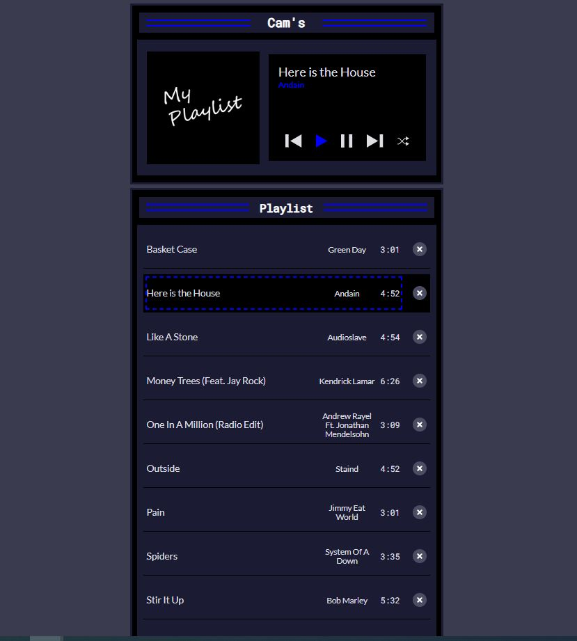

# My Music Player

## Table of contents

- [Overview](#overview)
  - [The challenge](#the-challenge)
  - [Screenshot](#screenshot)
  - [Links](#links)
- [My process](#my-process)
  - [Built with](#built-with)
  - [What I learned](#what-i-learned)
  - [Continued development](#continued-development)
- [Author](#author)

## Overview

### The challenge

Users should be able to:

- View the optimal layout for the app depending on their device's screen size
- See hover states for all interactive elements on the page
- The App should operate like a regular music player with functions(play, pause, stop. previous, next and shuffle)

### Screenshot

### Links

- Live Site URL: [View](https://camkol.github.io/MyMusicPlayer/)

## My process

- In the project's HTML structure, the main content is housed within an index.html file, featuring a container division that holds the music player and playlist components.
- These components are styled using CSS defined in a styles.css file, which customizes various aspects like font styles, colors, and layout properties.
- The interactive behavior of the music player is managed through JavaScript in a script.js file, which utilizes event listeners to handle song playback, navigation, and playlist management functions.
- The playlist data, containing details of each song, is stored in an array format within the JavaScript file, enabling dynamic song selection and rendering.
- Audio playback is controlled using the Audio object, allowing for play, pause, and track navigation functionalities.
- Together, these files and their associated code create a cohesive web application for playing and managing a music playlist, with an emphasis on responsive design and user interaction.

### Built with

- Semantic HTML5 markup
- CSS custom properties
- Flexbox
- CSS Grid
- Mobile-first workflow
- Mobile-Responsive Design
- JavaScript - Scripting language

### What I learned

I learned about querying variables, but I believe I still need practice.

### Continued development

I really want to see later of the possibilities of what I can do with this

## Author

- Website - [Cameron Howze](https://camkol.github.io/)
- Frontend Mentor - [@camkol](https://www.frontendmentor.io/profile/camkol)
- GitHub- [@camkol](https://github.com/camkol)
- LinkedIn - [@cameron-howze](https://www.linkedin.com/in/cameron-howze-28a646109/)
- E-Mail - [cameronhowze4@outlook.com](mailto:cameronhowze4@outlook.com)
